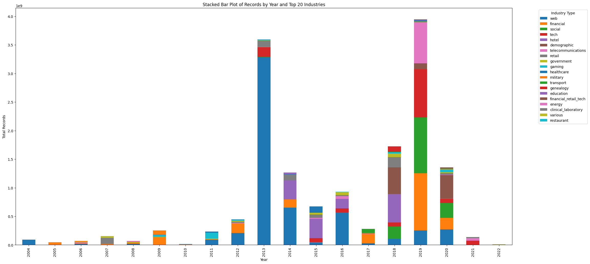

# Detecting the next data breach

## Problem Statement
The dataset df_1.csv is a mostly numeric, tabular dataset which contains over 351 company data breach data totaling 30,000 records.
There are 7 columns: Entity, year, records, organization type, method, sources, and id.

The goal of the project is to leverage the dataset and develop an ML algorithm that can analyze the data and identify how the next data breach will occur. This will be particularly useful to companies that are looking to prevent data breaches from occurring in the future.

I approached this as a classification problem.

Classification: Predicting the method of breach based on the organization, entity name, type, and scale of the breach.

## Overview of the approach
- [Data cleaning and preprocessing](#data-cleaning-and-preprocessing)
- [Exploratory data analysis](#exploratory-data-analysis)
- [Feature engineering](#feature-engineering)
- [Model building](#model-building)
- [Model evaluation](#model-evaluation)

## Overview of the dataset
Entity: Name of the company that was breached. This could be useful in future iterations of the project to identify if there are any patterns in the names of the companies that are breached. (NLP)

Year: Year in which the breach occurred. Some entries are non-numeric.

Records: Number of records that were breached. Some entries are non-numeric.

Organization type: Type of organization that was breached. This is a categorical variable. Some entries are similar but have different names.

Method: Method of breach. This is a categorical variable. Some entries are similar but have different names.

Sources: Hyperlinked sources to the articles that were used to collect the data.

## Data cleaning and preprocessing

The Organization types were modified to group similar types together. for example, "telcoms", "telecom", and "telecomms" were converted to the parent group "telecommunications"

A similar classification was done with the Methods column.

For the Records column, ill formatted entries were replaced with the mean of the records with the same organization type.

The Years column had some ill formatted entries. For example, some entries had the year as 2004-05, 2004-06, etc. In these cases, the rows were duplicated for each year in the range, and the number of records split evenly between the years.

``` txt
     Entity                                             Year            Records     Organization type   Method  
 
94                                             EasyJet  2019-2020       13394400    transport           hacked    
96   Earl Enterprises(Buca di Beppo, Earl of Sandwi...  2018-2019       2000000     restaurant          hacked    
144                                      Hilton Hotels  2014 and 2015   363000      hotel               hacked  
```
Null values:  False
Non numeric values:  True


## Exploratory data analysis
The dataset might not be fully representative of real world data breaches – for example, looking at the healthcare industry alone, there are years where no entries were lost. Cursory research shows that this is not the case, although the spike in 2014-2015 is accurate, and the steady increase thereafter.




[Source](https://www.hipaajournal.com/healthcare-data-breach-statistics/)


This could be because the dataset is not fully representative of all data breaches that have occurred in the past 15 years. It is also worth noting that the range of entries in the dataset is between 2004 and 2019, so more recent data breaches are not included.

In both the real-world data and our given dataset, The loss/theft of healthcare records and electronically protected health information dominated the breach reports between 2009 and 2015. The move to digital record keeping, more accurate tracking of electronic devices, and more widespread adoption of data encryption have been key in reducing these data breaches.

Healthcare data is so valuable because it often contains all of an individual's personally identifiable information, and a single healthcare data record can be worth up to $250 per record as compared to $5 for the next highest value record, which is card payment information.

As such, there are strict HIPAA (The Health Insurance Portability and Accountability Act) guidelines and rules regarding safeguarding healthcare data, and a healthcare company can be fined up to $50k per record for data lost in a data breach, not including civil monetary penalties to individuals affected by a breach. 

## Feature engineering
The categorical variables were one-hot encoded. The numerical variables were scaled using the StandardScaler.

## Model building
The features consist of the encoded categorical variables and the scaled numerical variables. The target variable is the method of the breach. The neural network consists of linear layers with activation functions. The MSE was used as the loss function, and the Adam optimizer was used to update the model's weights during training. The model was trained for 20 epochs, and cross-validation was used to tune the model on different subsets of the data.

## Model evaluation
Classification – predicting the method of the data breach: The model performs relatively well with a 81.82% accuracy score. 

